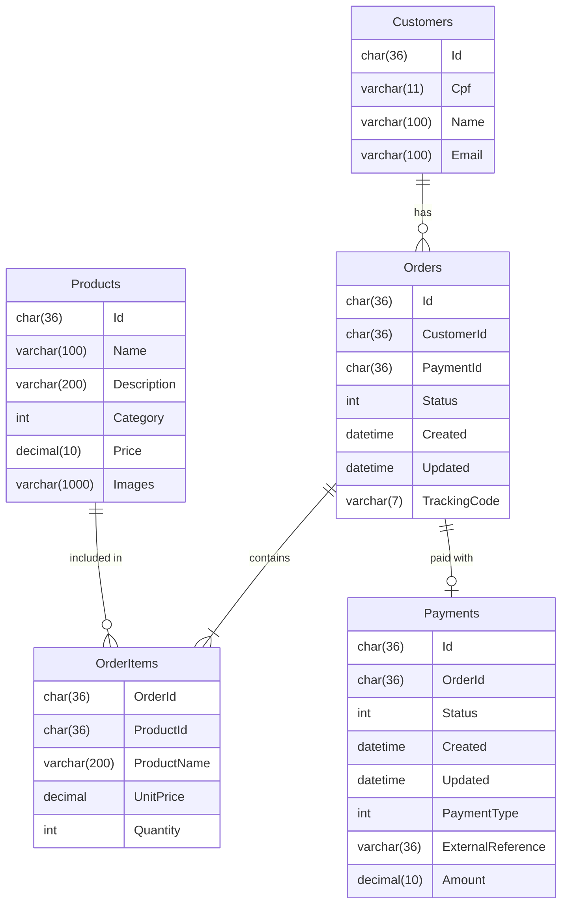

# bmb.database

[](https://github.com/soat-fiap/bmb.database/actions/workflows/terraform.yaml)

## Project Overview

This project contains the database schema and related files for the BMB application. The schema is defined using SQL scripts and managed with Terraform.

## Folder Structure

```
/bmb.database/
├── README.md
├── main.tf
├── variables.tf
├── outputs.tf
├── terraform.tfvars
└── scripts/
    ├── create_tables.sql
    ├── insert_data.sql
    └── update_schema.sql
```

## Dependencies
- [VPC](https://github.com/soat-fiap/bmb.infra)

## Getting Started

To get started with this project, ensure you have Terraform installed. Then, initialize and apply the Terraform configuration:

```sh
terraform init
terraform apply
```


## ERD



## This repo on the infrastructure

