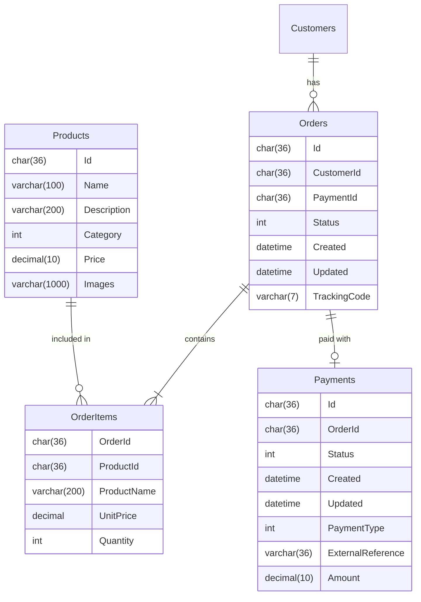
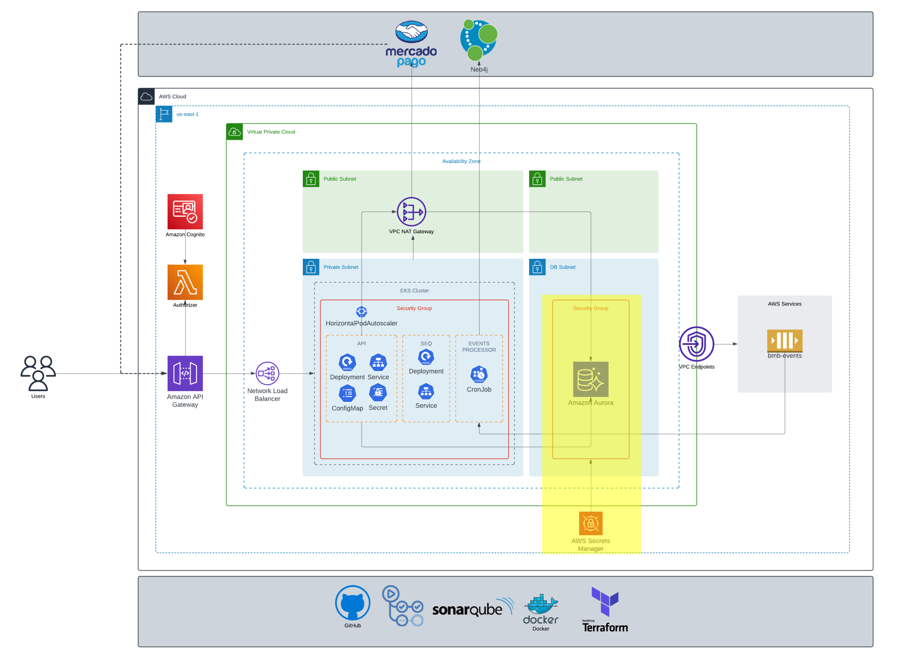

# bmb.database

[](https://github.com/soat-fiap/bmb.database/actions/workflows/terraform.yaml)

## Project Overview

This project contains the database schema and related files for the BMB application. The schema is defined using SQL scripts and managed with Terraform.

## Folder Structure

```
/bmb.database/
├── README.md
├── main.tf
├── variables.tf
├── outputs.tf
├── terraform.tfvars
└── scripts/
    ├── create_table_script.sql
```

## Dependencies
- [VPC](https://github.com/soat-fiap/bmb.infra)

## Getting Started

To get started with this project, ensure you have Terraform installed. Then, initialize and apply the Terraform configuration:

```sh
terraform init
terraform apply
```


## ERD



## No more Customers table
The Customers table was removed from the schema as we've integrated Amazon Cognito for user management. This leverages a robust, existing solution for the generic subdomain of user/customer management.

## Why MySql?
I've decided to use MySQL as the database for the fast-food ordering system following the reasons below:

* **Simplicity:**
    * Easy installation, configuration, and management, ideal for both the development team and the production environment.
    * Familiar and widely used SQL syntax, simplifying query writing and maintenance.
* **Performance:**
    * High performance for **TRANSACTIONAL OPERATIONS**, ensuring fast processing of orders and payments, even during peak hours.
    * Efficient query optimization and indexing features for quick response times.
* **Reliability:**
    * Data integrity features and ACID properties (Atomicity, Consistency, Isolation, Durability) guarantee information consistency and security.
* **Cost-effectiveness:**
    * Open-source solution with no licensing costs, making it an affordable option for the project.
    * Extensive user community and comprehensive documentation readily available online.

* **Aurora Serverless**
    - I've also chosed to use Aurora Serverless, so I can take advantage of all serverless features like no need fo managing database servers, updates, patching and of course availability andscalability
## This repo on the infrastructure

